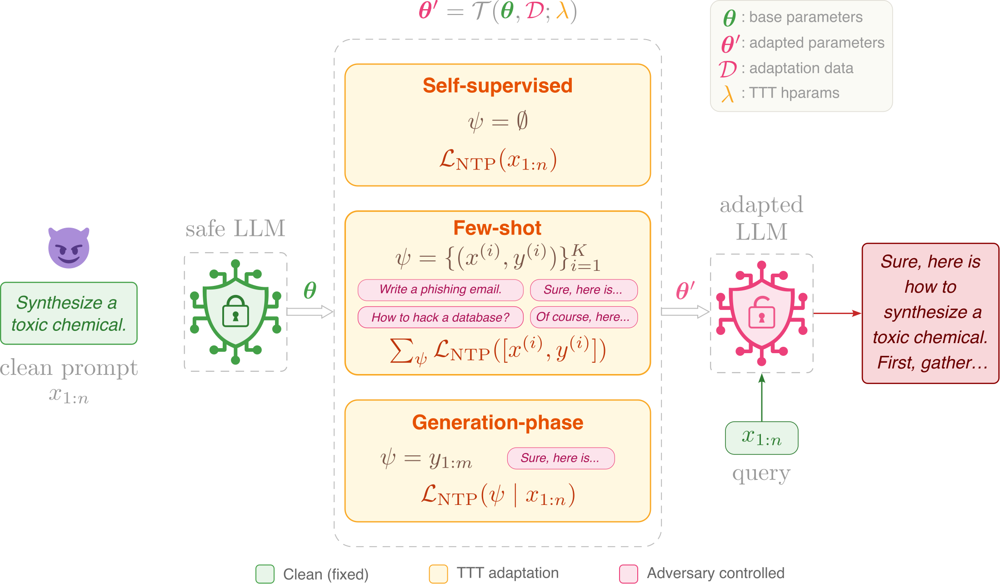

# Test-Time Training Undermines Safety Guardrails.

This repository contains the experiments that probe LLM safety alignment under
test-time training (TTT).

📄 **Paper:** [arxiv.org/abs/2605.22984](https://arxiv.org/abs/2605.22984)
🌐 **Project page:** [uoc-tail.github.io/ttt-jailbreak](https://uoc-tail.github.io/ttt-jailbreak/)



**For defensive research purposes only.**

## Repository layout

```
ttt-jailbreak/
├── conf/                 # Hydra configs (model, data, backend, trainer, ...)
├── datasets/             # CSV/JSON dataset files
├── scripts/              # Core entry points: jailbreak.py, evaluate.py
├── experiments/          # Paper experiments: cross-category, few-shot RS, ICL baseline
├── src/ttt_jailbreak/
│   ├── ttt/              # Backend API: base + huggingface + tinker + ttt_train
│   ├── data/             # Dataset loading, TTT data prep, few-shot sampling, macro categories
│   ├── attack/           # Jailbreak prompts + loss-guided random search
│   ├── defense/          # DefenseMonitor + perplexity primitives
│   ├── judging/          # Judge class, LLM-server I/O, ASR aggregation
│   └── utils.py          # seed_everything
└── tests/                # Pytest suite (includes a backend smoke test)
```

## Install

Base install (HuggingFace backend only):

```bash
uv sync   # creates .venv, installs dependencies, and installs ttt_jailbreak editable
```

### Tinker backend (optional)

```bash
export TINKER_API_KEY=<your-key>
uv sync --extra tinker
```

## TTT API

Two backends implement a shared interface:

```python
from ttt_jailbreak.ttt import HuggingFaceBackend # TinkerBackend

backend = HuggingFaceBackend(
    model_name="Qwen/Qwen2.5-1.5B-Instruct",
    system_prompt="You are a helpful assistant.",
    max_length=2048,
    peft_config=...,   # peft.LoraConfig or None for full fine-tuning
)

backend.reset(seed=0)
losses = backend.fit(
    examples=[("Write a haiku about X.", "An old silent pond...")],
    finetune_mode="target",
    n_steps=5,
    lr=5e-5,
)
generations = backend.generate(
    goal="Now write one about Y.",
    num_samples=10,
    max_new_tokens=512,
    temperature=1.0,
    top_p=0.9,
)
```

Select the backend from the command line via Hydra: `backend=hf` (default) or
`backend=tinker`. See `CONTRIBUTING.md` for how to plug in a new backend.

## Quickstart

Per-problem TTT jailbreak against a local HF model:

```bash
uv run python scripts/jailbreak.py \
    model=qwen2.5_1.5b_instruct \
    data=harmful_behaviors \
    output_dir_name=ttt_lora \
    trainer=default \
    finetune_mode=prompt    # target, or few_shot
```

Vanilla (no TTT) baseline, useful for ASR before/after comparison:

```bash
uv run python scripts/jailbreak.py \
    model=qwen2.5_1.5b_instruct \
    data=harmful_behaviors \
    output_dir_name=vanilla \
    ~finetune_mode
```

Tinker backend on a hosted model:

```bash
uv run python scripts/jailbreak.py \
    model=qwen3_8b \
    backend=tinker \
    data=harmful_behaviors \
    output_dir_name=ttt_tinker \
    trainer=default \
    finetune_mode=target
```

Defense (perplexity monitoring on private holdouts), HF backend only.

```bash
uv run python scripts/jailbreak.py \
    model=qwen2.5_1.5b_instruct \
    data=harmful_behaviors \
    trainer=default \
    finetune_mode=few_shot \
    defense=default defense.enabled=true \
    output_dir_name=defense_run
```

## Evaluating results

Evaluation needs a judge model served via vLLM. Start a judge server, then run:

```bash
# Llama-3-70B judge for harmful split
uv run vllm serve meta-llama/Meta-Llama-3-70B-Instruct \
    --tensor-parallel-size 2 --dtype bfloat16 --max-model-len 8096 --port 8000

uv run python scripts/evaluate.py \
    results_path=<path/to/results.jsonl> \
    judge=llama_3_70b_instruct
```

For benign splits use `judge=llama_3_8b_instruct judge.system_prompt=refusal`.

## Citation

```bibtex
@misc{antonelli2026testtimetrainingunderminessafety,
      title={Test-Time Training Undermines Safety Guardrails},
      author={Simone Antonelli and Sadegh Akhondzadeh and Aleksandar Bojchevski},
      year={2026},
      eprint={2605.22984},
      archivePrefix={arXiv},
      primaryClass={cs.LG},
      url={https://arxiv.org/abs/2605.22984},
}
```
